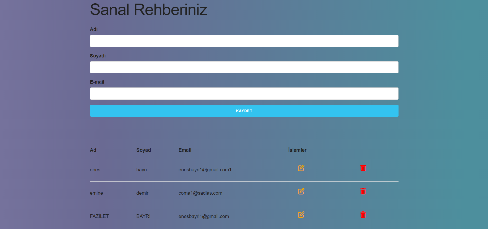

# ***JS SANAL REHBER WEBSİTE***

  

<b>-> Bu web site kişilerinizi(rehberinizi) local storage ile tutar ve listeler. </b>
  

-> Bu proje JS ile yapılmıştır.. 
-> Kişiler local storage da tutulur yani web browser hafızası silinirse notlar da kaybolur! 
-> Kişi ekleme,düzenleme ,silme işlemleri yapılabilmektedir!
 

 
 

    <h6>Ana Sayfa:</h6> 
      

